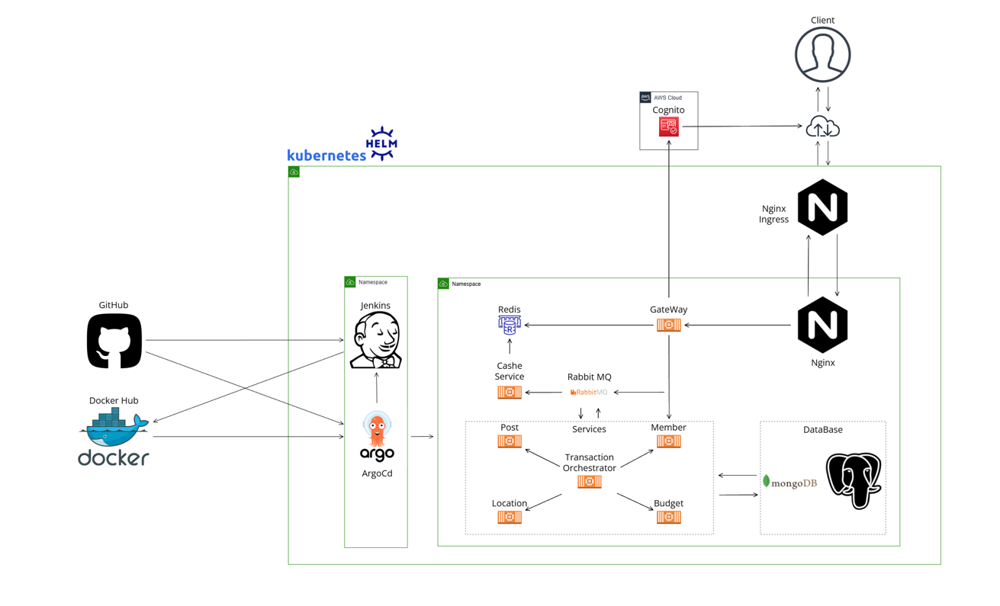

# Docker-Compose to Kubernetes 마이그레이션 프로젝트

[](https://kubernetes.io)
[](https://www.jenkins.io)
[](https://argoproj.github.io/cd/)
[](https://www.docker.com/)
[](https://helm.sh/)


기존 Docker-Compose 기반의 [여행 관리 앱 백엔드 서비스](https://github.com/jth0809/AWS_Free_Tier_Microservice)를 고가용성(High Availability)과 배포 자동화를 위해 Kubernetes 환경으로 전환하는 프로젝트입니다.

<br>

## 목차 (Table of Contents)

1.  [프로젝트 소개](#1-프로젝트-소개)
2.  [기존 아키텍처(Docker-Compose)의 한계](#2-기존-아키텍처docker-compose의-한계)
3.  [개선된 아키텍처 (Kubernetes & GitOps)](#3-개선된-아키텍처-kubernetes--gitops)
4.  [기술 스택](#4-기술-스택)
5.  [환경 구성 및 실행 방법](#5-환경-구성-및-실행-방법)
6.  [향후 개선 계획](#6-향후-개선-계획)

<br>

## 1. 프로젝트 소개
-   **프로젝트 기간**: 2024.12 ~ 2025.01 (쿠버네티스 전환)
-   **작업 인원**: 1명
-   **핵심 목표**:
    -   Kubernetes의 Auto-scaling, Self-healing 기능을 활용하여 **고가용성** 확보
    -   Jenkins와 ArgoCD를 이용한 GitOps 기반의 CI/CD 파이프라인을 구축하여 **배포 자동화** 달성

<br>

## 2. 기존 아키텍처(Docker-Compose)의 한계

-   **단일 장애점 (SPOF)**: 각 컨테이너의 오토스케일링(Auto-scaling)이나 자동 복구(Self-healing) 기능이 없어, 특정 컨테이너에 장애가 발생하면 서비스 중단으로 이어질 수 있습니다.
-   **수동적인 업데이트**: 롤링 업데이트(Rolling Update)와 같은 무중단 배포 전략을 기본적으로 지원하지 않아, 서비스 업데이트 시 수동 개입이 필요하며 과정이 번거롭습니다.

<br>

## 3. 개선된 아키텍처 (Kubernetes & GitOps)

위 한계를 극복하기 위해 Kubernetes를 도입하고, Jenkins와 ArgoCD를 이용한 GitOps 파이프라인을 구축했습니다.



-   **CI (Continuous Integration) - by Jenkins**:
    1.  개발자가 소스 코드를 GitHub에 푸시하면, **GitHub Webhook이 Jenkins를 트리거**합니다.
    2.  Jenkins는 자동으로 코드를 빌드, 테스트하고 Docker 이미지를 생성합니다.
    3.  생성된 최신 버전의 이미지를 Docker Hub와 같은 이미지 레지스트리에 푸시합니다.

-   **CD (Continuous Deployment) - by Argo CD**:
    1.  **(수동 단계)** 배포할 이미지 버전 정보 등이 담긴 내용을 수동으로 업데이트합니다.
    2.  Argo CD는 이 Manifest 리포지토리의 변경 사항을 실시간으로 감지합니다.
    3.  리포지토리의 상태와 클러스터의 현재 상태가 다른 것을 확인하면, 자동으로 동기화하여 새로운 버전을 클러스터에 배포합니다.

<br>

## 4. 기술 스택

| 구분 | 기술 |
|---|---|
| **Orchestration** | `Kubernetes` |
| **IaC** | `Terraform`, `Ansible` |
| **CI** | `Jenkins` |
| **CD (GitOps)** | `Argo CD` |
| **Package Manager**| `Helm`|
| **Container** | `Docker` |
| **OS** | `Linux` |

<br>

## 5. 환경 구성 및 실행 방법

> ⚠️ **중요**: 이 프로젝트는 install.sh 외에도 수동 설정이 필요 할 수 있습니다.  

**사전 준비**: `microservice` 애플리케이션 배포 시, AWS Cognito 관련 환경변수 설정이 필요합니다. (ArgoCD의 설정 파일을 통해 주입하는 것을 권장합니다.)

**실행 명령어**:
```bash
# 1. Git 저장소 복제
git clone [https://github.com/jth0809/Devops_Automation_K8s.git](https://github.com/jth0809/Devops_Automation_K8s.git)

# 2. 프로젝트 디렉토리로 이동
cd Devops_Automation_K8s

# 쿠버네티스와 헬름이 설치되지 않았다면...
./install.sh

# 3. 배포하려는 서비스 폴더로 이동
cd <select-folder>

# 4. Helm을 이용한 배포
helm install <release-name> ./
```

<br>

## 6. 향후 개선 계획

-   **CI/CD 파이프라인 완전 자동화**: Jenkins 빌드 성공 시, 새로운 이미지 태그를 리포지토리에 자동으로 업데이트하는 파이프라인을 구성하여, 현재의 수동 개입 지점을 제거하고 완전한 CI/CD 자동화를 구현.
